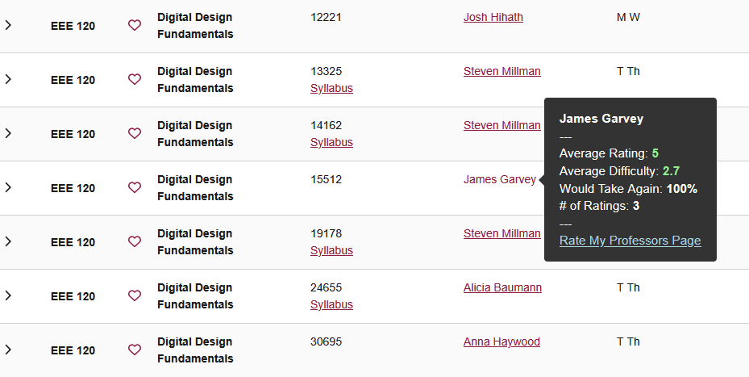

# ASU Rate My Professors

Other Rate My Professors extensions for the ASU course catalog were only available on the Chrome web store, and were extremely unreliable. They were unable to properly fetch rating data for many professors. I made this extension for Firefox to remedy these issues.

This extension simply contacts the Rate My Professors GraphQL API and grabs rating data for professors. It then provides the info in a little popup that appears when hovering over a professor's name.

The process for getting professor rating data is as follows:

1. User hovers over a professor's name, extension captures this name.
2. Remove parenthesis and any text within the name. Text within parenthesis could be preferred pronouns or nicknames
3. Contact GraphQL API and receive professor rating data.
4. Check if professor name that we got from the API is the same as the one we hovered over, basically, make sure the API actually returned the correct professor
5. If the fetch failed, retry with possible nickname. This is done by keeping a hash table that maps names to common nicknames.

In the end, I decided to take this extension off of the Firefox add-on store because I felt that Rate My Professors was a terrible metric for determining how good or bad a professor is. Most of the reviews are left by frustrated students who simply found the class difficult. I also didn't want to condone the practice of rating instructors on a scale of 1 to 5. It's disrepectful and dehumanizing.