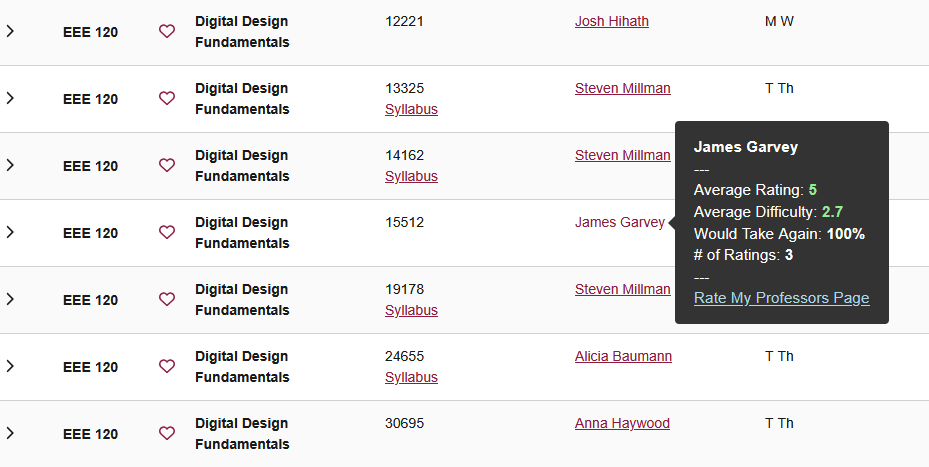

# ASU Rate My Professors

I made this because other Rate My Professors extensions for the ASU course catalog were only available on the Chrome web store and were extremely unreliable.

When a user hovers over a professor's name, the extension captures that name and begins the following process:

1. Use regular expressions to remove parentheticals from the name. Text within parenthesis could be preferred pronouns or a nickname.
2. Send name to the Rate My Professors GraphQL API and receive rating data.
3. Check if the professor name that we received from the API is the same as the one we hovered over. This is to make sure the API actually returned the correct professor.
4. If the fetch failed, retry with a possible nickname. This is done by keeping an object that maps names to common nicknames.
5. Display rating data in a small tool-tip that appears over the professor's name.

In the end, I decided to take this extension off of the Firefox add-on store because I felt that Rate My Professors was a terrible metric for determining how good or bad a professor was. Most of the reviews are left by frustrated students who simply found the class difficult. Also, I didn't want to condone the practice of rating instructors on a scale of 1 to 5; it's disrespectful and dehumanizing.
